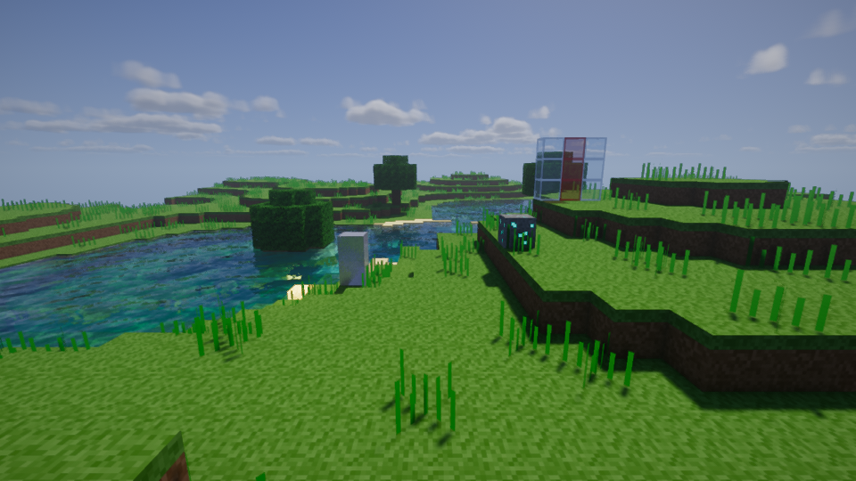
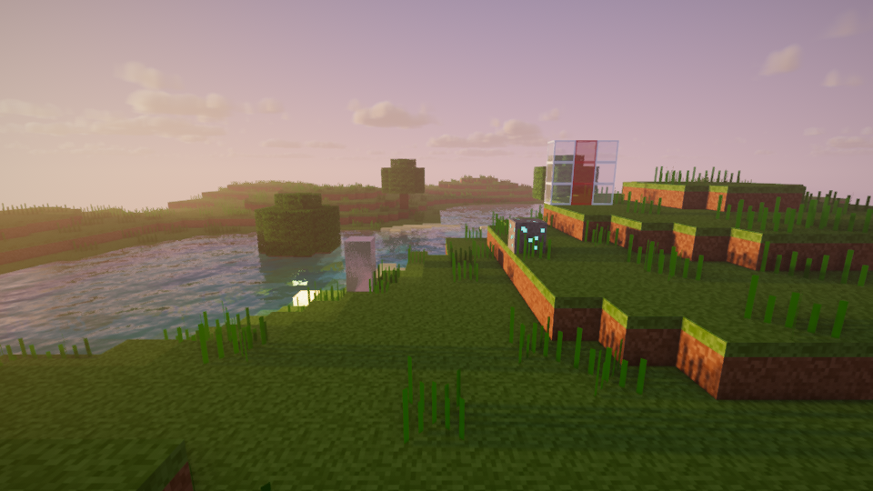
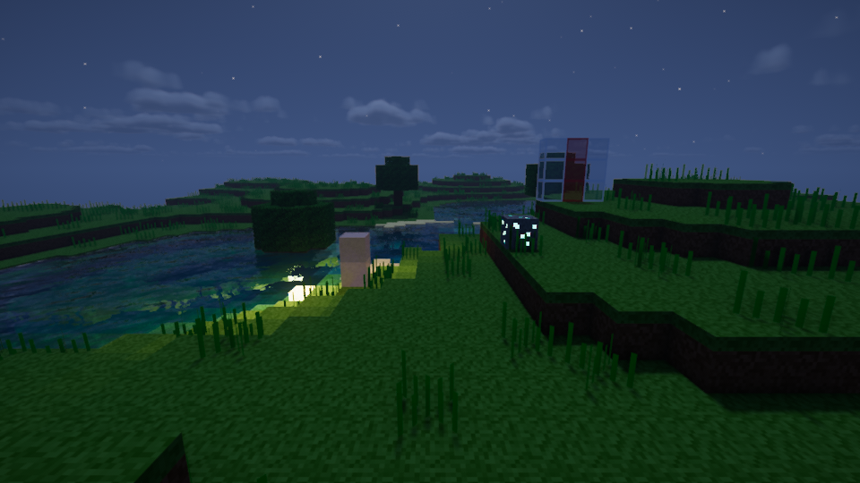
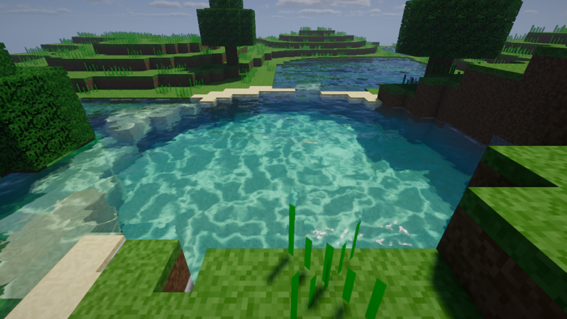
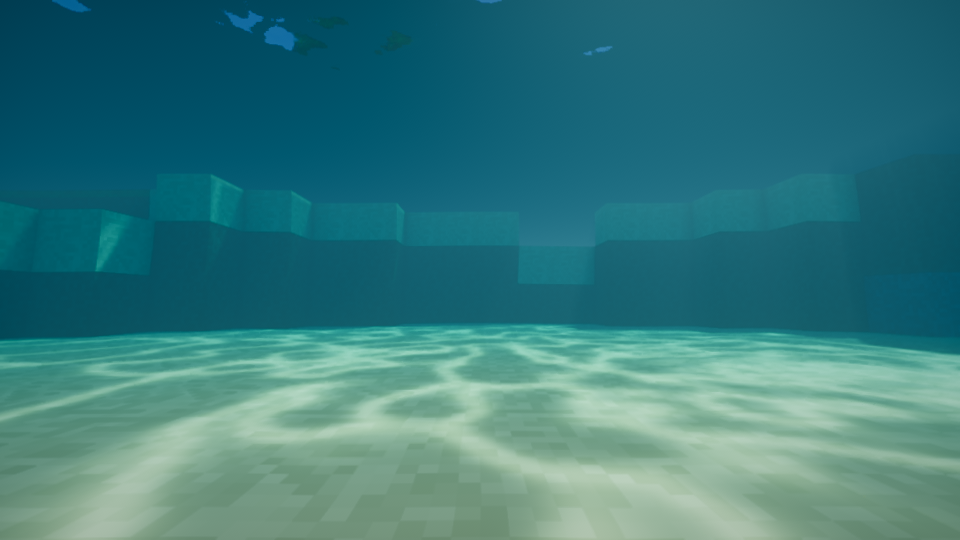
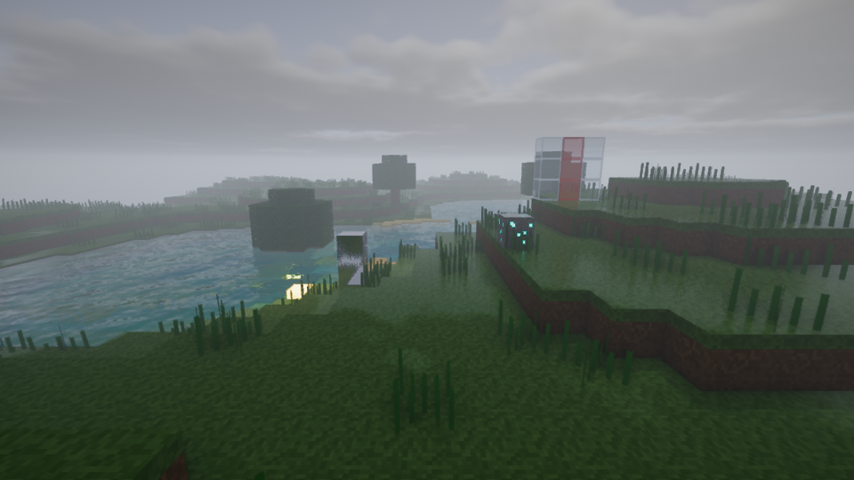

# Yukitus Shader

A modern, performance-friendly shader pack for **Minecraft Java 1.21.11 – 26.x** (Iris; OptiFine-format compatible).
Inspired by the look of Complementary: clean, colorful, soft and atmospheric — without melting your CPU.

## Screenshots (headless test renders)

| Noon | Sunset | Night |
|---|---|---|
|  |  |  |
| **Water** | **Underwater** | **Rain** |
|  |  |  |

## Features

| Area | What you get |
|---|---|
| Shadows | Soft PCF shadows (Vogel disk + TAA), colored shadows through stained glass, water caustics projected through the shadow map, cloud shadows |
| Lighting | Sun/moon light with time-of-day colors, sky ambient, warm block light, handheld light, subsurface scattering on leaves & plants, SSAO |
| Materials | Integrated PBR: shiny metals, polished stone, gems, glowing ores/torches/lava/redstone/sculk, wet surfaces & puddles in rain. Optional **labPBR** resource pack support |
| Water | Animated normal-mapped waves, refraction, depth absorption, screen-space reflections, sun highlights, underwater fog, total internal reflection |
| Sky | Procedural atmosphere, sunsets/sunrises, sun disc, moon with phases, twinkling stars, aurora borealis (snowy biomes), rainbows after rain |
| Clouds | Volumetric clouds (cheap 2.5D raymarch) with silver lining |
| Atmosphere | Volumetric light / god rays (air + underwater), morning fog, rain fog, border fog, custom Nether & End atmospheres |
| Post | TAA + sharpening, multi-level bloom, auto exposure, ACES / Lottes / Reinhard tonemapping, color grading, vignette, optional DoF & motion blur |
| Menu | Full in-game settings menu (English + German) with **Potato / Low / Medium / High / Ultra** profiles |

## Installation

1. Install **Iris** (Fabric/NeoForge) for your Minecraft version.
2. Download `Yukitus-Shader-v1.0.0.zip` (do **not** unzip it).
3. Put the zip into `.minecraft/shaderpacks/`.
4. In game: *Options → Video Settings → Shader Packs → Yukitus Shader*.

> Shader packs are `.zip` files, not `.jar` files — only mods are `.jar`.

## Performance tips

* The biggest **CPU** cost of any shader is the shadow pass (the world is drawn a second time from the sun).
  Lower **Shadow Distance** and disable **Entity Shadows** to save CPU.
* The biggest **GPU** costs are shadow filter quality, volumetric clouds and reflections.
* Use the profiles: *Low* for integrated graphics, *Medium* for older GPUs, *High* (default) for mid-range GPUs, *Ultra* for high-end.

## Development

```
shaders/
  program/        shared GLSL for every pass (VSH / FSH in one file)
  lib/            settings, lighting, sky, clouds, water, shadows, ...
  world0|world-1|world1/   thin per-dimension wrappers (generated)
  lang/           menu translations (generated)
tools/
  generate.py     generates wrappers, block.properties and textures/noise.png
  lang.py         generates lang files
  validate.py     static checks: options, menus, profiles, lang
  build.py        builds the release zip
  harness/        headless Iris-like pipeline emulator (Mesa) used for compile + render tests
```

Regenerate + test:

```
python3 tools/generate.py && python3 tools/lang.py && python3 tools/validate.py
Xvfb :99 & DISPLAY=:99 python3 tools/harness/iris_emu.py compile
DISPLAY=:99 python3 tools/harness/iris_emu.py render --times 0.2,0.48,0.75
python3 tools/build.py
```

## License

MIT — see `LICENSE`.
